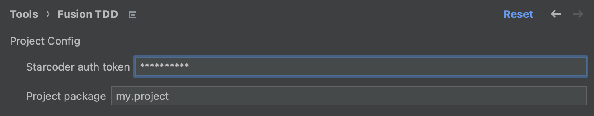
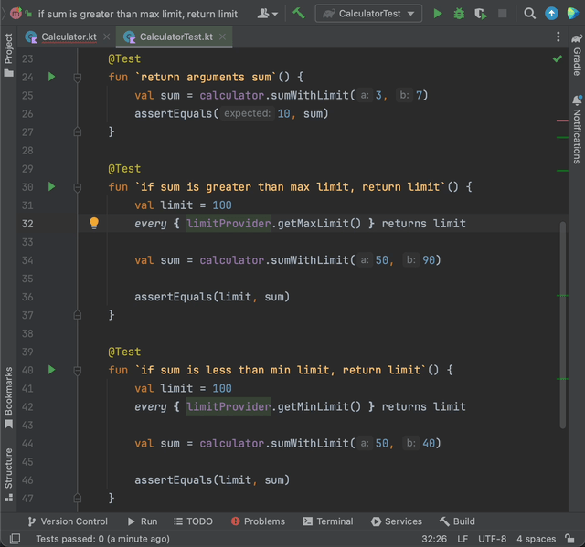

### What is it
A plugin for generating product code using tests written in advance for it. It is expected that it will become an indispensable assistant in TDD/BDD styles of coding.

### State
The plugin is in an early stage of development. You shouldn't use it on real problems, just try it on dummy and suggest improvements.
Currently it works **only with Kotlin** projects.

### How to use
The easiest way to try is to pull the project and run `./gradlew runIde`.

But firstly, you need to get a token from the [HuggingFace](https://huggingface.co/settings/tokens).

Enter the received token into the plugin settings. You also need to fill out your project package, only classes with the specified package will be scanned to collect the generation context.

Further, in the IDE, create a project, create a Kotlin class, a target function with an empty body, write tests for it and start generation.

Enjoy, and suggest improvements!